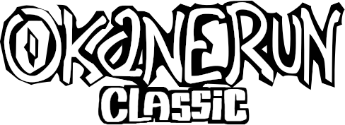

OKaneRun Classic is a small top-down action-platformer game built with **LÖVE (Love2D)**.

This repository contains the full source code.  
The project is open for learning, experimentation, and collaboration.

---

## Running the game

You’ll need **LÖVE 11.x** installed.

```bash
love .
```

---

## Engine

This project contains an experimental version of the FÖRE engine.

To learn more, please read project's [WiKi](https://github.com/Foxplort/OKaneRun-Classic/wiki).

---

## Contributing

Issues and pull requests are welcome.
See [`CONTRIBUTING.md`](CONTRIBUTING.md) for guidelines.

---

## License

- Game code - non-commercial license
- Game assets - All Rights Reserved
- FÖRE engine - MPL-2.0

See the LICENSE files in each directory for details.  
See the [`LICENSE.md`](LICENSE.md) file for general information.
